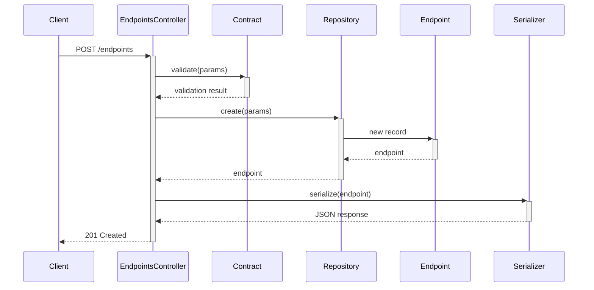

# Mock Echo

Mock Echo is a simple API mocking service that allows you to create and manage mock endpoints for testing and development purposes.

## Features

- Create, update, and delete mock endpoints
- Support for all standard HTTP methods
- Custom response codes, headers, and bodies
- JSON:API compliant interface
- Repository pattern for flexible storage options
- Robust validation using Dry::Validation
- Delay and override response code

## Installation

```sh
docker compose build
docker compose up app
```

## Usage

### Managing Endpoints

The `/endpoints` path is used to manage your mock endpoints. All requests must include appropriate JSON:API headers.

#### Create a new endpoint:
```sh
curl -X POST http://localhost:3000/endpoints \
  -H "Content-Type: application/vnd.api+json" \
  -H "Accept: application/vnd.api+json" \
  -d '{ 
    "data": { 
      "type": "endpoints", 
      "attributes": { 
        "verb": "GET", 
        "path": "/greeting", 
        "response": { 
          "code": 200, 
          "headers": {}, 
          "body": "{ \"message\": \"Hello, world\" }" 
        } 
      } 
    } 
  }'
```

#### Using Mock Endpoints

Once created, you can make requests to your mock endpoints:

```sh
curl http://localhost:3000/greeting
```

## Development

The project follows clean architecture principles:

- **Repository Pattern**: Currently uses ActiveRecord for storage, but can be easily switched to any other persistence layer or in-memory storage for testing.
- **Validation**: Uses Dry::Validation for extensible and flexible validation rules.
- **API Contract**: Follows JSON:API specification for consistent API interactions.

## Running the tests

```sh
docker compose run --rm app bundle exec rails test
```

## API Documentation

### Endpoints API

All endpoints require the following headers:
- `Content-Type: application/vnd.api+json`
- `Accept: application/vnd.api+json`

Available operations:
- `GET /endpoints` - List all endpoints
- `GET /endpoints/:id` - Get specific endpoint
- `POST /endpoints` - Create new endpoint
- `PATCH /endpoints/:id` - Update endpoint
- `DELETE /endpoints/:id` - Delete endpoint

## Sequence Diagram



## TODO

- Add authentication
- Allow to create endpoints per user
- Add support for subdomain routing
- Move `/endpoints` to separate subdomain so you can define mocked request to `/endpoints` path
- Add endpoint to define delay and override response code per endpoint

## License

MIT